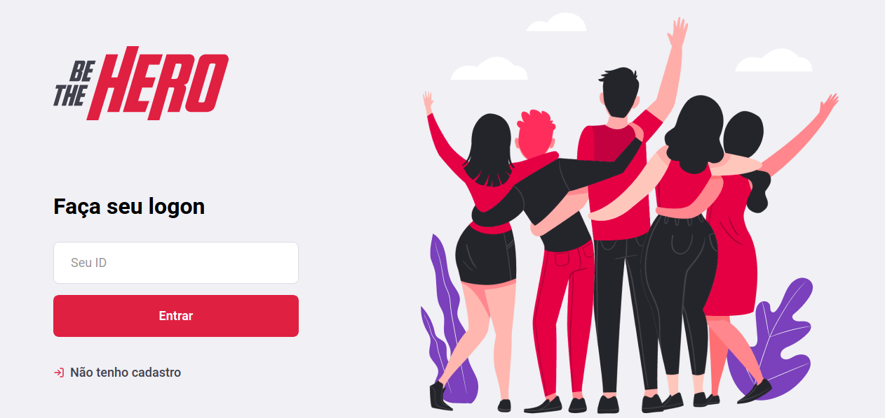

  

# Be The Hero - Frontend

## Overview

The main objective of this project is to provide a way to help Non-Governmental Organisation find "Heroes" to help in their causes. This can be done by providing a [web](https://github.com/igorsouza-dev/bethehero-frontend) interface for the NGO to insert their needs and then a "Hero" can find these needs using a [mobile app](https://github.com/igorsouza-dev/bethehero-mobile) and get in touch with the organization.
You will need the backend of this project and you can find it [here](https://github.com/igorsouza-dev/bethehero-backend).

  

## Setting up

### Requirements

- [Node.js](https://nodejs.org/en/download/)
- [Npm](https://www.npmjs.com/get-npm)
- [Yarn](https://yarnpkg.com/lang/en/docs/install/#debian-stable) - This is optional but in this readme I'll be using it on some CLI commands, you can use npm if you want.

### Dependencies

- [React.js](https://reactjs.org/) - JavaScript library for building user interfaces
- [Axios](https://github.com/axios/axios) - Promise based HTTP client
- [React Icons](https://react-icons.netlify.com/) - Icons library
- [React Router Dom](https://reacttraining.com/react-router/web/guides/quick-start) - DOM bindings for React Router.
- [Sweet alert](https://sweetalert2.github.io/) - A beautiful, responsive, customizable, accessible (WAI-ARIA) replacement for JavaScript's popup boxes

### Dev Dependencies

- [Eslint](https://eslint.org) - Ecmascript linter
- [Prettier](https://prettier.io) - Code formatter

## Installing

All you need to do is run `yarn` at the root of the project in order to install the dependencies.
After installation, copy the `.env.example` and rename it to `.env`. Change the `REACT_APP_URL` to target your backend URL.

## Starting

Just run `yarn start`.

## License

This is a open-sourced software licensed under the [MIT license](LICENSE.md).
